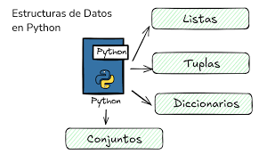
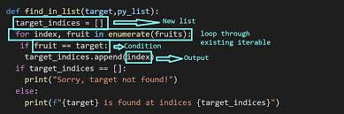
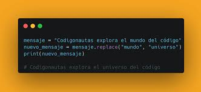
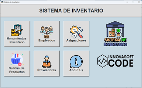
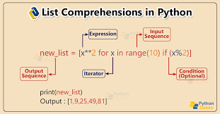

# Dominado-las-listas-en-python

# DOMINANDO LAS LISTA EN PYRHON

### EL PROBLEMA DE LAS VARIABLES 

° una variable simple es una caja pequeña: solo puede guardar una cosa a la vez

### la solucion: el sistema de inventario

° una estructura de datos te permite agrupar y organizar multiples elementos. en python, tu mejor herramienta es la lista

### anatomia de una lista en python 

°Una lista en Python es una estructura de datos ordenada y mutable que permite almacenar múltiples elementos (incluso de distintos tipos) separados por comas dentro de corchetes []. Su anatomía se caracteriza por ser indexada (empieza en 0), dinámica (se puede modificar) y permitir elementos duplicados

### El secreto del indice cero 

° para encontrar un elemento, usas su indice (su numero de posicion). pero cuidado: !las computadoras empiezan a contar desde el cero!

### entrenando con el inventario 

° usa los corchetes [] junto al nombre de la lista para extraer un dato

# MODIFICANDO DATOS (EL REEMPLAZO)

° puedes reescribir el contenido de cualquier ranura asignandole un nuevo valor directamente

### trucos utiles del inventario

Gestionar inventarios en Python es eficiente usando diccionarios para búsquedas rápidas O(1), collections.Counter para conteo automático de ítems, y pandas para análisis de datos masivos. Trucos clave incluyen actualizar stock con métodos de diccionario, usar POO para estructurar productos y try-except para validar entradas de usuario. 

### NIVEL 3. SUPERDODERES (LIST COMPREHENSIONS)

¿ que pasa si lista es gigante?

modificar 3 amigos es facil pero ¿ que pasa si tienes una base de datos con 1.000 usuario y necesitas filtrar solo que tienen ciertas edad? hacerlo uno por uno es muy superpoder

